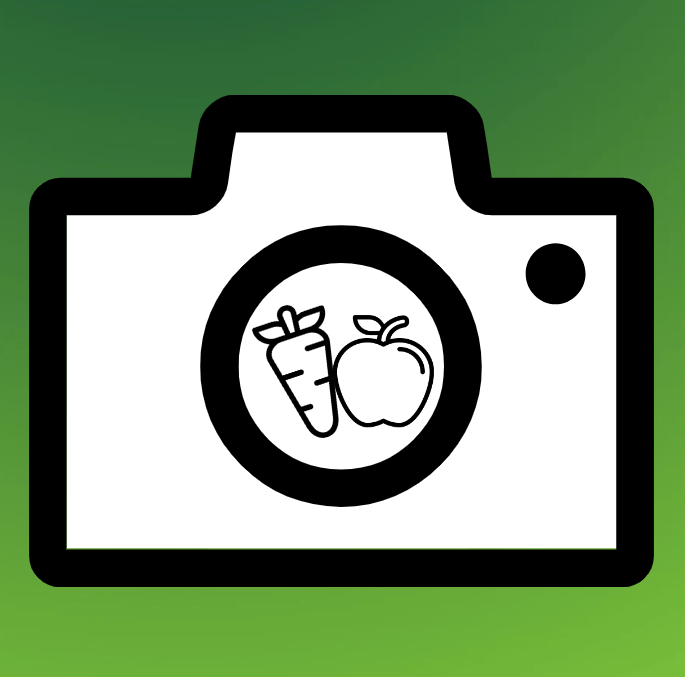

# FoodSnaps

TLDR: Using computer vision and machine learning, FoodSnaps identifies the foods in front of you and provides you with accurate nutrition facts and easy to make healthy recipes.

<h2>Background</h2>

This project was made during HackWestern 2022 to help people identify the foods in front of them and make healthier food choices. Using your phones camera, FoodSnaps is able to find exactly what you are eating or what you plan to make food with. We then calculate the nutrition facts to inform the consumer of the nutritional value of the foods they are eating. With this information, we can then provide the user with easy to make healthy recipes that include the ingredients they have in front of them. Another feature that FoodSnaps includes is that if the food is not directly with you, we can still help you find delicious and healthy recipes based on the users input.

<p align="center">
  
</p>


<h2>How It Works</h2>

Using Adhawk MindLinks to track eye position of user when on the website to create a heat map of what they are looking at. This data can be analyzed later to determine what users are focusing on, allowing developers to make improvements based on it. 

<h2>System Requirements</h2>

To recreate this project you will need the following hardware:
- A Windows, Mac or Linux computer
- A mobile device with Expo Go installed to run your project on


To recreate this project you will need the following software:
- React Native
- Expo
- LogMeal API


<h2>Alternative Options (... And Why Our Method Is Better)</h2>

| Analytics Option | Description | Differences |
| --- | --- | --- |
| EYEs.py | - Tracks user behaviour at the core by tracking a physical component (their eyes) | - Tracks how the user interacts with their computer by directly tracking the eyes which are directed at what the user focuses on |
| MSFT Clarity | - Tracks user clicks, frequency of clicks, mouse position over time, etc | - Tracks user input through a layer of hardware so there's some data lost inherently |
| Google Analytics | - Session duration, bounce rate, engagement, traffic, etc | - Doesn't track how the user utilizes the UI so pain points and confusing areas in the UI are harder to catch |

<h2>Steps to Replicate</h2>

1. Clone the repository
	```sh git clone git@github.com:shaansuthar/Eye-Tracking-Heatmap.git```
2. Install the Adhawk Back End (attach the link here)
3. Install all dependencies using ```pip install *insert_dependencies_here*```
4. Run screen_tracking.py
	```sh python screen_tracking.py```


<h2>Next Steps</h2>

There are many things that we can do to improve on this project for the future, including:
- Create a recording tool to display the order in which each part of the website was viewed (i.e. the user first viewed the top left part of the page)
- Implementing a web-based front end with an API communication layer with Python backend
- Adapting our heat maps to adjust with scrolling and changing routes in a website
- Creating a dashboard for managing different user recordings and grouping the data
- Rescaling to prevent the tracking markers from covering content
- Combine insights with Microsoft Clarity and Google Analytics to get even more data on website performance for a wider variety of scenarios
- Train an AI/machine learning model to suggest changes by noticing pain points in the UI


<h2>Things We Used</h2>


Created by: [Shaan Suthar](https://www.linkedin.com/in/shaan-suthar/), [Richard Li](https://www.linkedin.com/in/richardli2003/), [Fraser MacFarlane](https://www.linkedin.com/in/fraser-macfarlane/), and [Matthew Mark](https://www.linkedin.com/in/matthew-mark-/)

